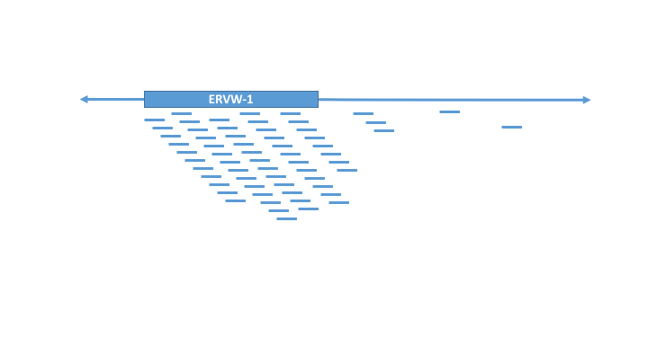

# CHERVIL

Computational Human Endogenous RetroViral Infection Landscape is a pipeline and analytical tool for detection of endogenous retroviral expression features that correspond to current or previous viral infection.





## What is CHERVIL and why do we need it?
Human endogenous retroviral elements (HERVs) are retroviruses that have integrated themselves into the human germline. Usually, they remain latent in the human genome. However, previous work suggests that some HERVs become actively transcribed upon viral infection. CHERVIL uses differential expression analysis of HERVs in healthy and infected populations via RNA-seq in  to detect pre-symptomatic or historic viral infection.

CHERVIL builds on an existing pipeline built for HERV detection [RetroSpotter](https://github.com/NCBI-Hackathons/RetroSpotter) and adds on a machine learning component to identify patterns in HERV expression specific to distinct viral infections.

## Overview Diagram of Workflow


### RetroSpotter Plus
* Utilize RetroSpotter to identify differentially expressed HERVs in infected populations
    + Supply SRA accession numbers for expression dataset of healthy and infection of interest samples
    + Supply database of HERV sequences of interest
* Generate HERV1 count dataframe
* Using [TPOT](https://github.com/EpistasisLab/tpot), apply machine learning to identify HERV expression patterns specific to viral infection.

## How to use CHERVIL

1. Input .csv file with two columns: accession numbers and their classifications.
```csv
SRR123456, infected
SRR789101, infected
SRR112131, infected
SRR415161, control
SRR718192, control
SRR021222, control
```
(note: these are made-up accessions)

2. Simple one line command to generate HERV count data
3. Other use info here?

## Installation
### Requirements

Before proceeding, ensure that you have the following installed and functional:

1. [R 3.5 or greater](https://cran.r-project.org)
2. [Python 3.6](https://www.python.org/downloads/release/python-365/)
3. [Magic-BLAST](https://ncbi.github.io/magicblast/)
4. [A towel](https://en.wikipedia.org/wiki/Towel_Day#Origin)

### Instructions

First, clone a copy of the repository:

    $ git clone https://github.com/NCBI-Hackathons/chervil.git

and then `cd` into it:

    $ cd chervil

Odds are that you will want to run CHERVIL in a [virtual environment](https://virtualenv.pypa.io/en/stable/). If you don't have virtualenv installed, run:

    $ pip install virtualenv

And then to set up your shiny new virtual environment:

    $ virtualenv env --python=python3.6
    $ source env/bin/activate

Next, to install the Python components, run:

    (env) $ pip install -r requirements.txt

Once you've installed the Python requirements, install [XGBoost](https://xgboost.readthedocs.io/en/latest/build.html). Be sure to [install the Python bindings](http://xgboost.readthedocs.io/en/latest/build.html#python-package-installation) for XGBoost as well.

## Example Run
### Example Dataset
* PRJNA349748: Human Tracheobronchial Epithelial (HTBE) cells infected with Influenza
    + Data Type: RNA-seq
    + Conditions / Samples: H1N1, H5N1, H3N2, mock-infected controls
